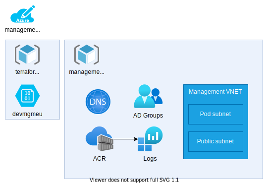

# 13. Management setup

Date: 2021-09-10

## Status

Status: Work in progress
Builds on [0006-management-environment.md](0006-management-environment.md) on 2021-09-10
Builds on [0012-ci-cd.md](0012-ci-cd.md) on 2021-09-10

## Context

Define the management environment resources and how it is setup.

## Decision

Management environment design:

Management environment setup requires some manual steps to get bootstrapped as it is the first environment that is created. After the initial setup, the environment can be managed the same way as others. The way the environment is setup is [described outside the ADR](../opsteady/initial-setup.md).

## Consequences

Eventually, the deployment will depend on the management platform. This means that if this environment breaks others can not be managed until it is fixed. It also means that CI/CD might not work as it depends on Vault.
